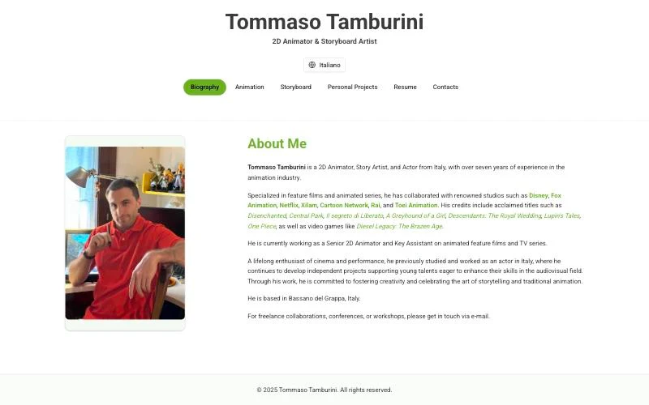
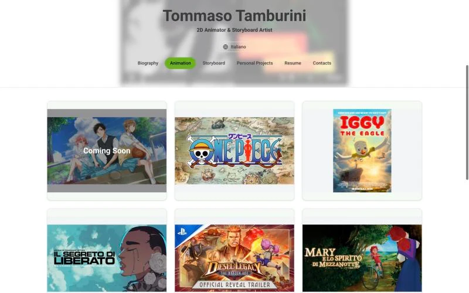
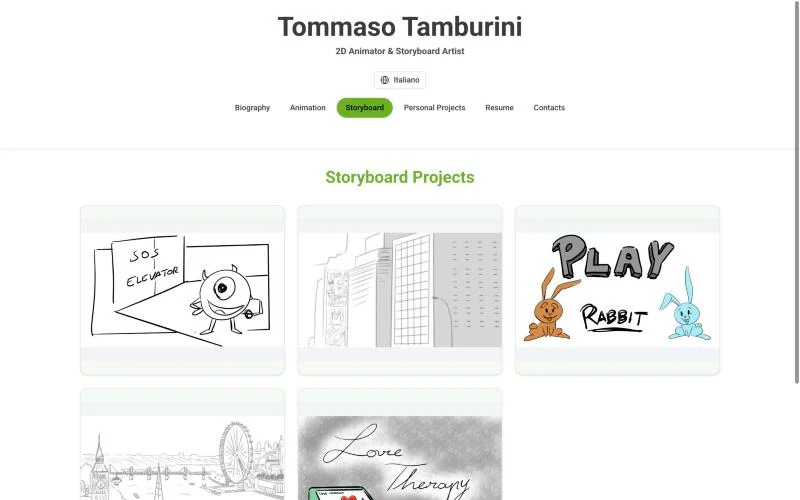
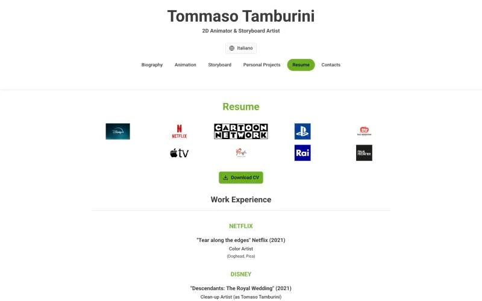

# Tommaso Tamburini - portfolio website

[](https://tommasotamburini.com)

Portfolio of **Tommaso Tamburini**, a 2D animator and story artist from Italy who has worked with studios such as Disney, Netflix and Fox Animation. The site presents his animation reels, storyboards, personal projects and a downloadable CV, in English and Italian.

**Live site: [tommasotamburini.com](https://tommasotamburini.com)**

<p align="center">
  
</p>

<table>
  <tr>
    <td width="33%"></td>
    <td width="33%"></td>
    <td width="33%"></td>
  </tr>
  <tr>
    <td align="center">Animation</td>
    <td align="center">Storyboard</td>
    <td align="center">Resume</td>
  </tr>
</table>

## Features

- **Six sections in one page**: biography, animation, storyboard, personal projects, resume and contacts, switched from a sticky navigation bar.
- **Video showcase**: Vimeo players for each production, opened from a card.
- **Storyboard galleries**: image viewer with next and previous controls.
- **English and Italian**: one button switches every text on the page.
- **Downloadable CV**: a PDF served by the site itself (`public/cv-tommaso-tamburini.pdf`).
- **Search engine basics**: page metadata, Open Graph and Twitter cards, `schema.org` structured data for the person, a sitemap and `robots.txt`.
- **Responsive layout** for phones, tablets and desktops.

## Tech stack

| Area      | Tools                                                           |
| --------- | --------------------------------------------------------------- |
| Framework | [Next.js](https://nextjs.org) 16 (App Router) and React 19      |
| Language  | TypeScript                                                      |
| Styling   | Tailwind CSS 4, [shadcn/ui](https://ui.shadcn.com) and Radix UI |
| Icons     | lucide-react                                                    |
| Media     | Vimeo embeds, images from `public/` and Vercel Blob storage     |
| Hosting   | [Vercel](https://vercel.com)                                    |
| Tooling   | pnpm                                                            |

## Getting started

You need Node.js 20.9 or newer and [pnpm](https://pnpm.io).

```bash
pnpm install
pnpm dev        # http://localhost:3000
pnpm build      # production build
pnpm start      # serve the production build
```

The first build downloads the Roboto font from Google Fonts, so it needs an internet connection.

## Project layout

```text
app/
  layout.tsx       page metadata, structured data and fonts
  page.tsx         the whole page: texts (English and Italian), sections and players
  sitemap.ts       sitemap
components/ui/     shadcn/ui components
public/            images, icons, robots.txt and the CV (cv-tommaso-tamburini.pdf)
scripts/
  generate-cv.py   builds a plain-text CV with reportlab (not used by the site yet)
docs/screenshots/  the pictures used in this README
```

To change a text, edit the `translations` object in `app/page.tsx` (one entry per language). To update the CV, replace `public/cv-tommaso-tamburini.pdf`; the Download CV button always points to that file.

## Deployment

The site is deployed on Vercel from the `main` branch; every pull request gets a preview deployment. Vercel installs the dependencies with pnpm, and `pnpm-workspace.yaml` allows the build script of `sharp` so the install does not stop in CI.

## Ideas for next steps

- Give each section its own URL (`/animation`, `/storyboard`...) instead of switching content inside one page. Links to a section would then be shareable and indexable, and the sitemap could list real pages instead of `#` anchors.
- Make the sticky header shorter on phones, so more of the content is visible.
- Host the images that are now on external storage inside the project and serve them with `next/image`.
- Add automated checks (type-check and build) to a GitHub Actions workflow.

## Credits and licence

Source code by [Kawe Longon](https://github.com/KaweAW). The artwork, posters, logos and videos shown on the site belong to Tommaso Tamburini and to the studios and rights holders of the productions; they are portfolio samples and no licence to reuse them is granted.
